<!--
**robertocuervot/robertocuervot** is a ✨ _special_ ✨ repository because its `README.md` (this file) appears on your GitHub profile.

Here are some ideas to get you started:

- 🔭 I’m currently working on ...
- 🌱 I’m currently learning ...
- 👯 I’m looking to collaborate on ...
- 🤔 I’m looking for help with ...
- 💬 Ask me about ...
- 📫 How to reach me: ...
- 😄 Pronouns: ...
- ⚡ Fun fact: ...
-->

# Hi there! 👋 Welcome to my GitHub Profile

## 💫 About Me

I am a **mechatronics engineer** passionate about **technology**, **Industry 4.0** and **coding** in general and always eager to learn new technologies.

- 🎓 Currently finishing my studies in general engineering as part of a double degree program.
- 🦾 Experienced in embedded systems programming and data analysis.
- 🌱 Learning full-stack developement and cybersecurity basics.
- 🤸‍♂️ Sports enthusiast, primarily focused on calisthenics, strength training, and skill development.

## 💻 Tech Stack

### **Im experienced with:**

 

 

 
 
 
 

 
 
 
 
 

### **I've worked with:**
 
 
 
 
 
 

 
 
 
 

<!-- Thanks to GPRM for helping me with the icons ( https://gprm.itsvg.in ) -->

## 📫 How to Reach Me

- 🌐 **Portfolio/Website:** [Coming Soon] 
- 📧 [**Email**](mailto:robertocuervotorres@hotmail.com)
- 💼 <a href="https://www.linkedin.com/in/ra-cuervotorres/" target="_blank"> <b>LinkedIn</b> </a>
